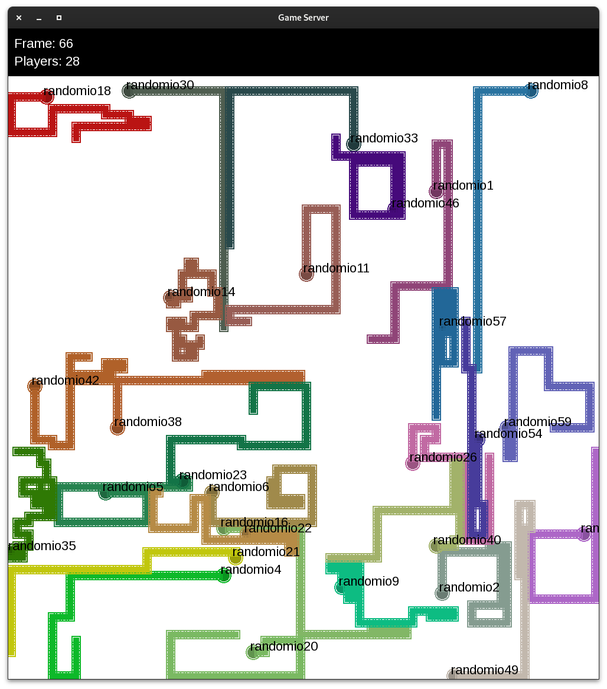

Cycles++ documentation
===================================

Cycles++ is a multiplayer implementation of the Light Cycles game from Tron. In this implementation bots play against other bots.

The game is played on a grid, where each player controls a cycle that leaves a trail behind it. The goal is to make the other players crash into the walls or the trails left by the other cycles.

The bots communicate with the server with a simple protocol over TCP. The server sends the game state to the bots and the bots respond with their actions.

The networking code as well as graphics are based on the `SFML <https://www.sfml-dev.org/>`_ library.

Installation
------------
The server and clients are written in C++ and require a C++20 compiler. All dependencies can be installed using the provided conda environment:

.. code-block:: bash

    conda env create -f environment.yml
    conda activate cycles

.. warning::

   There is a bug in the latest SFML package for linux (WSL in Windows included). Fixing it requires to manually create a missing symlink to libudev:

   .. code-block:: bash

      mamba install libudev
      ln -s $CONDA_PREFIX/lib/libudev.so.1 $CONDA_PREFIX/lib/libudev.so.0

   You might have to install the libudev package from conda.

.. warning::

   If you are on Windows and using the WSL you must install the graphical drivers:

   .. code-block:: bash

      sudo apt install mesa-common-dev
   
   
To build the server and the example client, clone the repository and run the following commands from the root directory of the repository:

.. code-block:: bash

    mkdir build
    cd build
    cmake ..
    cmake --build .

The server and the example client will be built in the `build/bin` directory.

Usage
-----
Both the server and the clients expect the environment variable `CYCLES_PORT` to be set to the port where the server will run.

To start the server, run the following command:

.. code-block:: bash

    ./build/bin/server <config_file>

.. sidebar::

   .. hint:: Replace ./build/bin/server with the actual name of the server binary if needed.
	     

config_file is the path to a yaml file containing some server options. The following is an example of a config file:

.. code-block:: yaml

		gameHeight: 1000
		gameWidth: 1000
		gameBannerHeight: 100
		gridHeight: 100
		gridWidth: 100
		maxClients: 60
		enablePostProcessing: false
The option enablePostProcessing is used to enable or disable the fancy graphic effects. If you are seeing weird graphical glitches you might want to disable the post processing.
To start a client using the example bot, run the following command:

.. code-block:: bash

    ./build/bin/client <name> 

name is the name of the bot. The bot will receive the game state from the server and will respond with its actions.
The example client will move the cycle in a random-ish direction.

You might want to :ref:`write your own bot <writing_a_bot>`.

Example launch script
*********************

The following script will start the server and some clients:

.. code-block:: bash
		
		export CYCLES_PORT=50017

		cat<<EOF> config.yaml
		gameHeight: 1000
		gameWidth: 1000
		gameBannerHeight: 100
		gridHeight: 100
		gridWidth: 100
		maxClients: 60
          	enablePostProcessing: false
		EOF

		./build/bin/server &
		sleep 1

		for i in {1..30}
		do
		./build/bin/client randomio$i &
		done

		     

.. toctree::
   :maxdepth: 2
   :caption: Contents:
   :hidden:

   writing-a-bot

Indices and tables
==================

   * :ref:`genindex`
   * :ref:`search`
